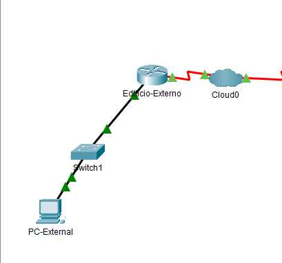
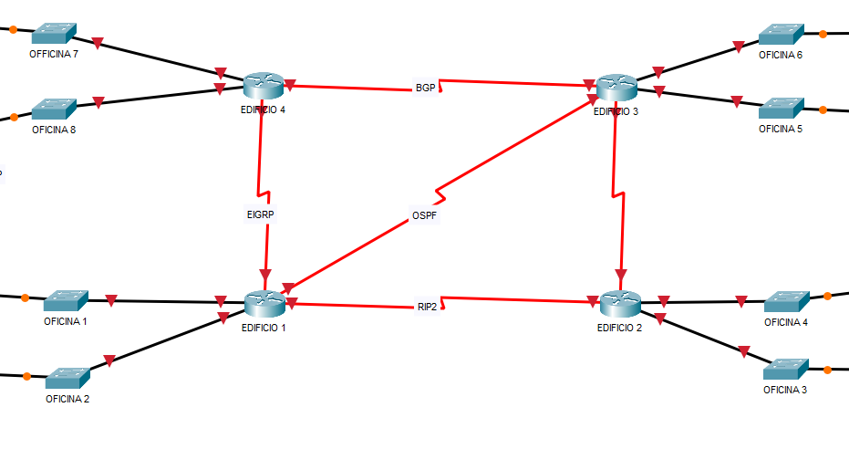
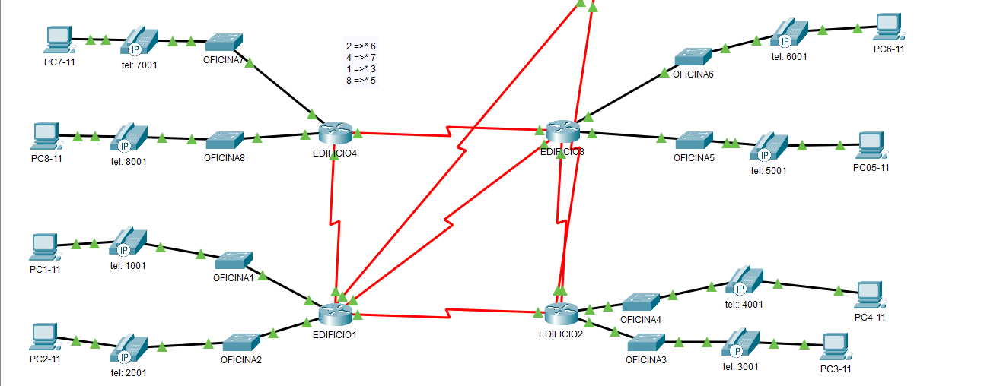

# Arquitectura de red para happyDuck - **BeeNet Comunications IoT**

![Logo][def]

| **Happy duck Inside** | **Corporativo** |
| :---------: |:------:|
|  | |

| **Edifico externo**  |
|:---------: |
||
## Edificios Happy Duck

### Edificio uno

[configuracion de edificio 1](./Edificio1.md)

### Edificio dos

[configuracion de edificio 2](./Edificio2.md)

### Edificio tres

[configuracion de edificio 3](./Edificio3.md)

### Edificio cuatro

[configuracion de edificio 4](./Edificio3.md)

## Edificio externo

[configuracion de edificio externo](./VPN.md)

## Corporativo

[configuracion del corporativo ](./Corporativo.md)

[def]: img/logo.png