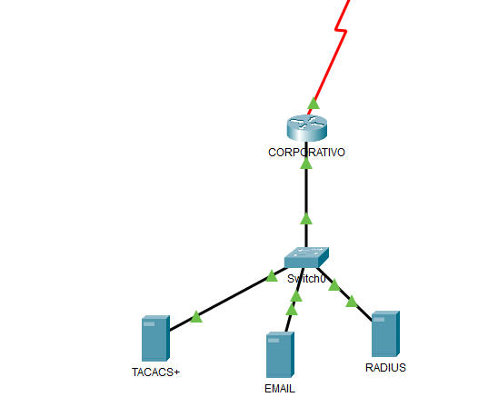

# PROYECTO FINAL REDES II

| **OUTSIDE** | **DMZ** |
| :---------: |:------:|
|  | |

| **INSIDE** |
|:---------: |
||

## INSIDE

### Edificio uno

[configuracion de edificio 1](./Edificio1.md)

### Edificio dos

[configuracion de edificio 2](./Edificio2.md)

### Edificio tres

[configuracion de edificio 3](./Edificio3.md)

### Edificio cuatro

[configuracion de edificio 4](./Edificio3.md)

## OUTSIDE

## DMZ
